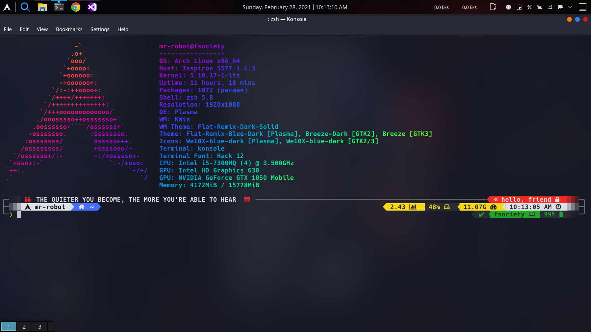

# Terminal Customization With The ZSH

Feeling bored with your regular terminal or do you need that extra cup of customization in your terminal, this one got you covered.

## Usefull Links

- [DaniRuiz - Kali Linux Official UI/UX designer's Pimp My Terminal Blog Post](https://drasite.com/blog/Pimp%20my%20terminal)
- [Oh My ZSH](https://github.com/ohmyzsh/ohmyzsh)
- [Powerlevel10K](https://github.com/romkatv/powerlevel10k)
- [Nerd Fonts](https://github.com/ryanoasis/nerd-fonts)
- [Gogh Color Scheme for Terminals](https://mayccoll.github.io/Gogh/)

## Prerequisites

- Linux Terminal
- ZSH installed

## Installation

#### 1. Headover to this github link of Oh-My-ZSH for the brief installation instructions. [Click Here](https://github.com/ohmyzsh/ohmyzsh)

- Instant Install

```shell
sh -c "$(wget -O- https://raw.githubusercontent.com/ohmyzsh/ohmyzsh/master/tools/install.sh)"

```

#### 2. Install PowerLevel10K

```shell
git clone --depth=1 https://github.com/romkatv/powerlevel10k.git ~/powerlevel10k
echo 'source ~/powerlevel10k/powerlevel10k.zsh-theme' >>~/.zshrc
```

#### 3. Restart the ZSH terminal

Now, the configuration wizard should start automatically, else type `p10k configure`.

#### 4. Install Hack Bold font.

Install [this](https://github.com/ryanoasis/nerd-fonts/blob/master/patched-fonts/Hack/Bold/complete/Hack%20Bold%20Nerd%20Font%20Complete.ttf) recommended font called Hack Bold.

#### 5. Customizing the color scheme of the terminal

Searching on the internet, you'll find plenty of color schemes for your terminal. But the easiest way to apply them is using this tool called [Gogh](https://mayccoll.github.io/Gogh/).

```shell
bash -c "$(curl -sLo- https://git.io/vQgMr)"
```

The color scheme we'll be using is the Flat Remix one. Run this command on the terminal,

```shell
bash -c "$(curl -sLo- https://git.io/JvvDs)"
```

else, head over to Pimp my terminal blog post mentioned above to copy the color scheme.

#### 6. Some aliases for productivity with cool color outputs

```shell
# This is a template; Replace "new-command" and "alias-name"
command -v new-command > /dev/null && alias alias-name='new-command ...'
```

```shell
alias ls='ls --color=auto'
alias grep='grep --color=auto'
alias fgrep='fgrep --color=auto'
alias egrep='egrep --color=auto'
alias diff='diff --color=auto'
```

#### 7. Coloring the Man Pages

```shell
export LESS_TERMCAP_mb=$'\e[1;32m'
export LESS_TERMCAP_md=$'\e[1;32m'
export LESS_TERMCAP_me=$'\e[0m'
export LESS_TERMCAP_se=$'\e[0m'
export LESS_TERMCAP_so=$'\e[01;33m'
export LESS_TERMCAP_ue=$'\e[0m'
export LESS_TERMCAP_us=$'\e[1;4;31m'
```

#### 8. lsd & tree Commands

```shell
command -v lsd > /dev/null && alias ls='lsd --group-dirs first'
```

```shell
command -v lsd > /dev/null && alias ls='lsd --tree'
```

#### 9. Install lolcat and neofetch

#### 10. Now, copy .p10k.zsh, .zshrc and vpn_env_set file to the home directory.

- Head over to the Dani Ruiz [blog post](https://drasite.com/blog/Pimp%20my%20terminal) for more customizations.

## Preview Screenshots




